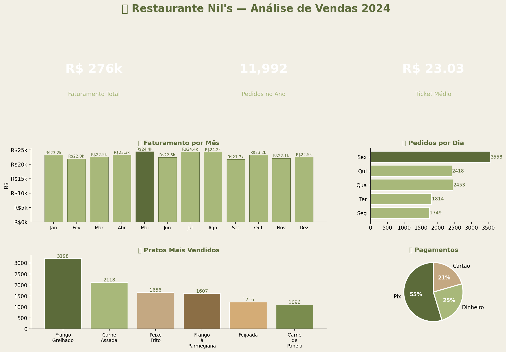

# 🍛 Análise de Vendas — Restaurante Nil's


## 📌 Sobre o Projeto

Análise exploratória de dados de vendas de um restaurante de marmitas, com foco em identificar padrões de consumo, horários de pico, pratos mais vendidos e formas de pagamento preferidas pelos clientes.

> 💡 Projeto desenvolvido como parte do meu portfólio de Análise de Dados.

---

## 📊 Dashboard



## 📊 O que foi analisado?

- 💰 **Faturamento mensal** ao longo de 2024
- 🍛 **Pratos mais vendidos** e preferências dos clientes
- 📅 **Dias da semana** com maior movimento
- ⏰ **Horários de pico** de pedidos
- 📍 **Bairros** com maior faturamento
- 💳 **Formas de pagamento** mais utilizadas

---

## 📈 Principais Insights

| Métrica | Resultado |
|---|---|
| 💰 Faturamento Total | R$ 244.934,00 |
| 🍛 Total de Pedidos | 12.346 |
| 🎯 Ticket Médio | R$ 19,84 |
| 📅 Melhor Dia | Sexta-feira |
| 🏆 Prato Mais Vendido | Frango Grelhado |
| ⏰ Horário de Pico | 12h00 |

---

## 🛠️ Tecnologias Utilizadas

- **Python 3** — linguagem principal
- **Pandas** — manipulação e análise dos dados
- **NumPy** — geração e cálculos numéricos
- **Matplotlib** — criação dos gráficos e dashboard
- **Jupyter Notebook** — ambiente de desenvolvimento

---

## 📁 Estrutura do Projeto

```
analise-nils-restaurante/
│
├── Analise_Vendas_Nils.ipynb   # Notebook com toda a análise
├── vendas_nils.csv             # Dataset gerado (12.346 pedidos)
├── dashboard_nils.png          # Dashboard principal
└── README.md                   # Este arquivo
```

---

## 🚀 Como Executar

1. Clone o repositório:
```bash
git clone https://github.com/BeatrizEmilia/analise-nils-restaurante.git
```

2. Instale as dependências:
```bash
pip install pandas numpy matplotlib seaborn jupyter
```

3. Abra o Jupyter Notebook:
```bash
jupyter notebook
```

4. Abra o arquivo `Analise_Vendas_Nils.ipynb` e execute as células!

---

## 👩‍💻 Sobre mim

Olá! Sou a Beatriz, estudante de Análise de Dados apaixonada por transformar números em insights úteis para negócios.

📧 Entre em contato: [LinkedIn](https://linkedin.com/in/seu-perfil)

---

⭐ Se esse projeto te ajudou, deixa uma estrela no repositório!
